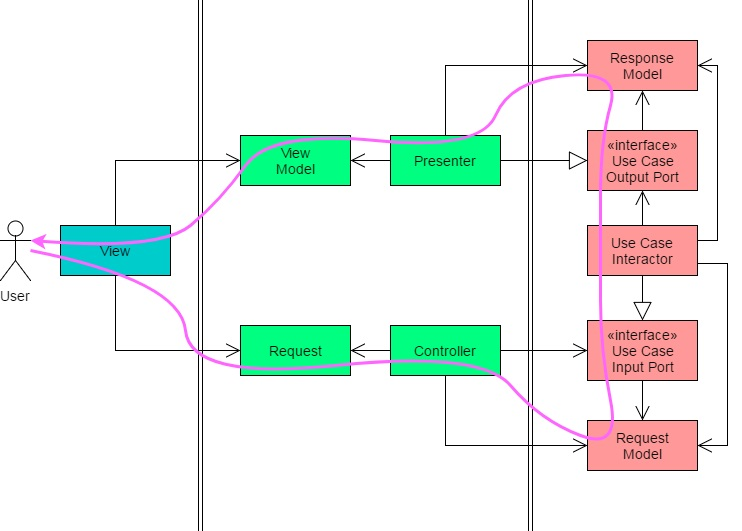
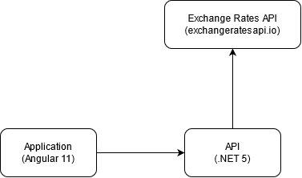
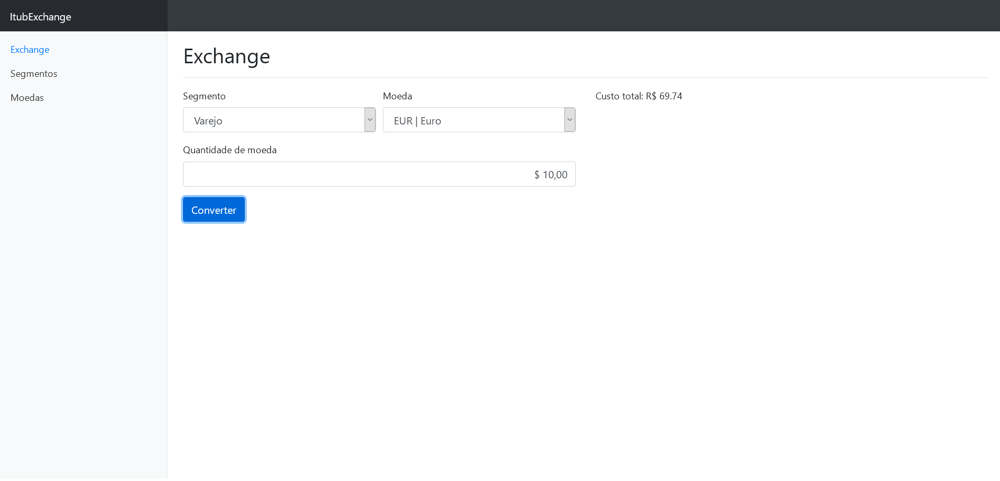
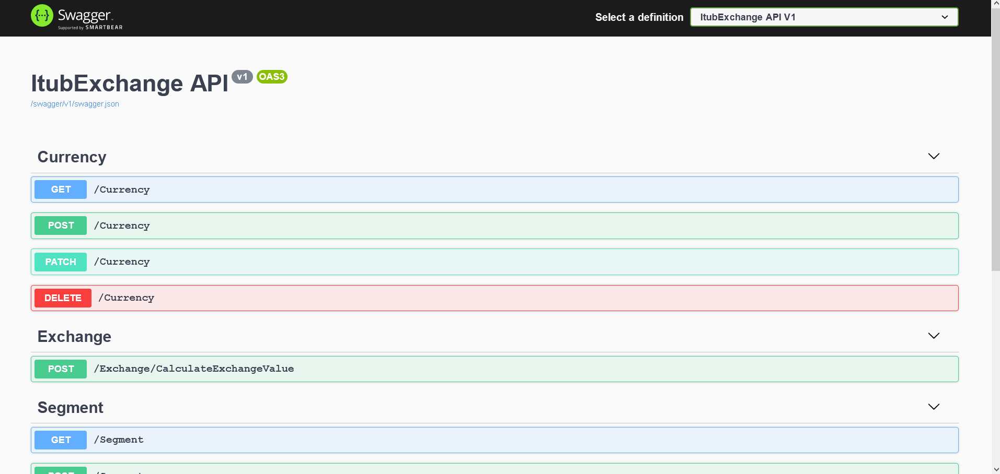

# Itub Exchange

Aplicação de cambio de moedas para diferentes segmentos de clientes, onde é possível configurar os segmentos,
suas taxas e as moedas disponíveis para câmbio.

## Conteúdo

* [Tecnologias](#Tecnologias)
  * [Arquitetura](#Arquitetura)
    * [Clean architecture](#clean-architecture)
    * [Componentes](#principais-componentes)
* [Screenshots](#screenshots)
  * [Tela de câmbio](#tela-de-câmbio)
  * [Tela de segmentos](#tela-de-cadastro-de-segmentos)
  * [Tela de Moedas](#tela-de-cadastro-de-moedas)
* [Setup](#setup)
  * [Iniciando o Frontend](#iniciando-o-frontend)
  * [Iniciando o Backend](#iniciando-o-backend)
  * [Iniciando com docker compose](#iniciando-utilizando-o-docker-compose)
  * [Recuperando imagens mais recentes](#recuperando-imagens-mais-recentes)
  * [APIs Swagger](#swagger)
* [Features](#features)

## Tecnologias

* Angular 11+
* .NET 5.0
* Docker
* NGINX
* Swagger

## Arquitetura

### Clean Architecture

A aplicação utiliza um estilo de arquitetura proposto por Robert C. Martin conhecida como __clean architecture__, onde as diferentes partes do sistema possuem um baixo grau de dependência, resultando em uma fácil manutenibilidade e testabilidade.  

O fluxo dos dados sempre flui das camadas mais externas para as mais internas, onde as camadas internas não tem referência as camadas superiores a elas, permitindo que regras de negócio possam ser isoladas e testadas de maneira independente.  

Este modelo também permite que a interface com o usuário (frontend) não interfira no funcionamento geral do sistema, assim como mudanças tanto de provedores externos quanto diferentes formas de consumo de APIs, bastando reimplementar a interface esperada pelos casos de uso.


Cada funcionalidade do sistema conta com seu caso de uso, onde suas portas de entradas e saídas possuem contratos definidos.



### Principais Componentes

A aplicação conta com 3 principais componentes, a interface com o usuário (Frontend em Angular 11),
a API (.NET 5) e a API externa responsável por prover a taxa de câmbio atualizada.  

As ações de cotação, gerênciamento de segmentos e moedas são enviadas e processadas pela API de backend antes de terem seus resultados refletidos em tela.



O processo de cotação ocorre da seguinte maneira:

1. As informações de segmento, moeda e quantidade são inseridas na aplicação.
2. As informações são enviadas para a API do backend.
3. A API de backend consulta a API da ExchangeRates para recuperar taxa de conversão atualizada para a moeda selecionada.
4. Com a taxa de conversão correta, a aplicação realiza a conta levando em consideração a taxa para o segmento do cliente escolhido.
5. O resultado da cotação é retornado, onde a aplicação de frontend exibe o valor final da cotação


## Screenshots

### Tela de câmbio



### Tela de cadastro de Segmentos


### Tela de cadastro de Moedas


## Setup

### Iniciando o Frontend

Os arquivos de frontend desenvolvidos em angular se encontram dentro de `src/ClientApp`.  
Instale os pacotes `npm` descritos em `package.json` e inicie o host executando os comandos a seguir:

```shell
npm install
npm start
```

O comando `npm start` irá compilar o TypeScript e copiar os Assets da aplicação para dentro da pasta `dist/`, e irá monitorar mudanças nos arquivos de código fonte.  

Para parar a execução, basta utilizar o comando `Ctrl+C` .

### Iniciando o Backend

Para iniciar o serviço de backend em dotnet 5, é necessário  utilizar o comando `dotnet run` dentro da pasta `src/ItubExchange.Host` como no exemplo a seguir.

```shell
cd src/ItubExchange.Host
dotnet run 
```

### Iniciando utilizando o docker compose

Caso deseje utilizar o `docker-compose` para iniciar tanto o projeto de __frontend__ quanto de __backend__, basta utilizar o comando como no exemplo a seguir.

```shell
docker-compose -f "src\docker-compose.yml" up -d --build
```

A configuração padrão determina que a aplicação de __frontend__ irá estar disponível em `http://localhost/` e a API irá estar disponível em `http://localhost:3000/`.

### Recuperando imagens mais recentes

Caso deseje baixar as imagens mais recentes do repositório publico do dockerhub, pode-se utilizar as imagens: `hbaldin/itubexchange-front:latest` e `hbaldin/itubexchange-api:latest` para o front e o backend respectivamente.

### Swagger

A API conta com uma UI do swagger onde é possível ver os endpoints, métodos e modelos utilizados por todas as ações disponíveis servidas pela API. Para ver a página do Swagger, basta acessar `http://localhost:3000/swagger` caso esteja utilizando o docker compose, ou acessar a página `http://localhost:5000` caso esteja utilizando  o debug do visual studio.



## Features

Lista de features disponíveis na versão atual do sistema:

* Cotação de moedas extrangeiras com taxas personalizadas por segmento de clientes
* Cadastramento e atualização de segmentos
* Cadastramento e atualização de moedas extrangeiras