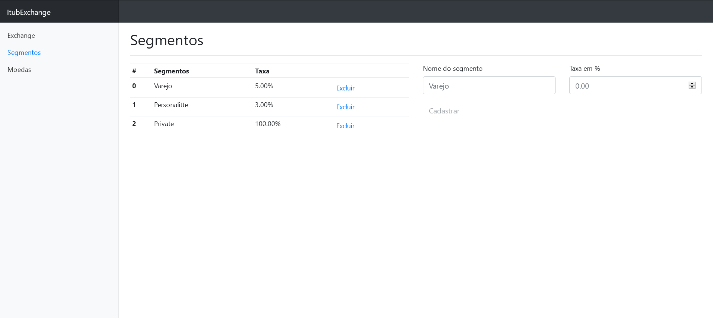

# Itub Exchange

Aplicação de cambio de moedas para diferentes segmentos de clientes, onde é possível configurar os segmentos,
suas taxas e as moedas disponíveis para câmbio.

## Conteúdo

* [Tecnologias](#Tecnologias)
  * [Arquitetura](#Arquitetura)
* [Screenshots](#screenshots)
  * [Tela de câmbio](#tela-de-câmbio)
  * [Tela de segmentos](#tela-de-cadastro-de-segmentos)
  * [Tela de Moedas](#tela-de-cadastro-de-moedas)
* [Setup](#setup)
  * [Iniciando o Frontend](#iniciando-o-frontend)
  * [Iniciando o Backend](#iniciando-o-backend)
  * [Iniciando com docker compose](#iniciando-utilizando-o-docker-compose)
* [Features](#features)

## Tecnologias

* Angular 11+
* .NET 5.0
* Docker
* NGINX

## Arquitetura


## Screenshots

### Tela de câmbio


### Tela de cadastro de Segmentos



### Tela de cadastro de Moedas


## Setup

### Iniciando o Frontend

Os arquivos de frontend desenvolvidos em angular se encontram dentro de `src/ClientApp`.  
Instale os pacotes `npm` descritos em `package.json` e inicie o host executando os comandos a seguir:

```shell
npm install
npm start
```

O comando `npm start` irá compilar o TypeScript e copiar os Assets da aplicação para dentro da pasta `dist/`, e irá monitorar mudanças nos arquivos de código fonte.  

Para parar a execução, basta utilizar o comando `Ctrl+C` .

### Iniciando o Backend

Para iniciar o serviço de backend em dotnet 5, é necessário  utilizar o comando `dotnet run` dentro da pasta `src/ItubExchange.Host` como no exemplo a seguir.

```shell
cd src/ItubExchange.Host
dotnet run 
```

### Iniciando utilizando o docker compose

Caso deseje utilizar o `docker-compose` para iniciar tanto o projeto de __frontend__ quanto de __backend__, basta utilizar o comando como no exemplo a seguir.

```shell
docker-compose -f "src\docker-compose.yml" up -d --build
```

A configuração padrão determina que a aplicação de __frontend__ irá estar disponível em `http://localhost/` e a API irá estar disponível em `http://localhost:3000/`.

## Features

Lista de features disponíveis na versão atual do sistema:

* Cotação de moedas extrangeiras com taxas personalizadas por segmento de clientes
* Cadastramento e atualização de segmentos
* Cadastramento e atualização de moedas extrangeiras